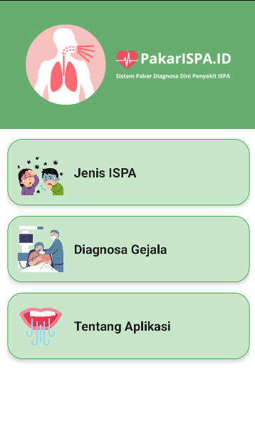
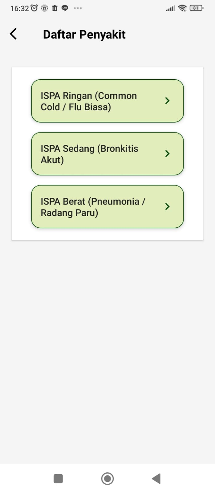
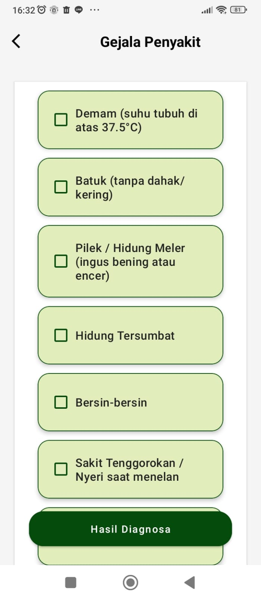
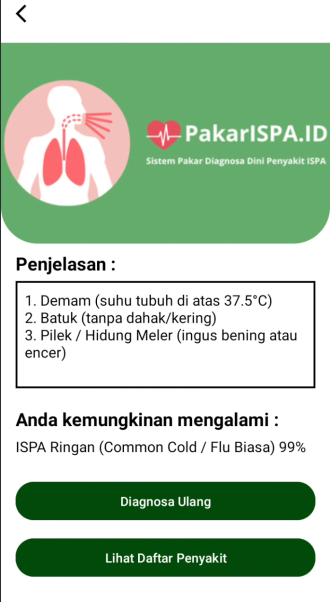
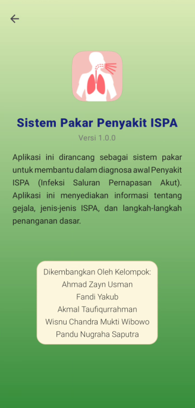

# 🩺 Sistem Pakar Deteksi Penyakit ISPA (Infeksi Saluran Pernapasan Akut) Berbasis Android

Aplikasi ini adalah sistem pakar berbasis Android yang dikembangkan menggunakan bahasa pemrograman **Java**. Tujuannya adalah membantu pengguna melakukan **diagnosis dini** terhadap **Infeksi Saluran Pernapasan Akut (ISPA)** berdasarkan gejala yang dirasakan.

Metode inferensi yang digunakan adalah **Certainty Factor (CF)** untuk menghitung tingkat keyakinan dari hasil diagnosis.

---

## 📜 Deskripsi Proyek

ISPA merupakan salah satu masalah kesehatan utama di Indonesia dengan tingkat penyebaran yang tinggi. Aplikasi ini dirancang sebagai **alat bantu praktis dan edukatif** untuk masyarakat agar dapat melakukan **deteksi awal ISPA secara mandiri**, sebelum berkonsultasi dengan tenaga medis profesional.

> Seluruh proses diagnosis dilakukan secara **offline** menggunakan basis pengetahuan yang disimpan di **SQLite database** lokal di perangkat pengguna.

---

## ✨ Fitur Utama

- ✅ **Diagnosa Berbasis Gejala**  
  Pengguna memilih gejala melalui antarmuka berbasis checkbox.

- 📊 **Hasil Diagnosa dengan Certainty Factor**  
  Menampilkan penyakit paling mungkin diderita beserta **persentase keyakinannya**.

- 📚 **Informasi Detail Penyakit**  
  Menyediakan penjelasan lengkap dan saran penanganan untuk setiap jenis ISPA (Ringan, Sedang, Berat).

- 🕘 **Riwayat Diagnosa**  
  Menyimpan dan menampilkan kembali hasil diagnosis sebelumnya.

- 📱 **Antarmuka Intuitif & Mudah Digunakan**  
  Didesain untuk pengguna awam dengan navigasi sederhana.

- 🌐 **Berfungsi Offline**  
  Tidak memerlukan koneksi internet untuk menjalankan diagnosis.

---

## 🧠 Metode Certainty Factor (CF)

### ⚙️ Cara Kerja Diagnosa

1. **Input Gejala oleh Pengguna**  
   Melalui `DiagnosaActivity.java`, pengguna memilih gejala yang dirasakan.

2. **Pengambilan Data**  
   Gejala yang dipilih akan diambil kode-nya dari database.

3. **Perhitungan CF**  
   Untuk setiap penyakit:
   - Sistem mencari aturan (rule) yang menghubungkan gejala tersebut dengan penyakit.
   - Jika ditemukan, nilai CF digabung menggunakan rumus:
```
CF_combine = CF_lama + CF_baru * (1 - CF_lama)

```

4. **Pengurutan Hasil**  
Penyakit diurutkan berdasarkan nilai CF tertinggi.

5. **Output Diagnosa**  
Penyakit dengan CF tertinggi ditampilkan sebagai **hasil utama**.

---

## 🛠️ Teknologi yang Digunakan

| Komponen            | Teknologi                  |
|---------------------|----------------------------|
| **Platform**         | Android                    |
| **Bahasa Pemrograman** | Java                       |
| **IDE**              | Android Studio             |
| **Database**         | SQLite                     |
| **Metode Inferensi** | Certainty Factor (CF)      |
| **UI Components**    | RecyclerView, MaterialCardView, Toolbar, CheckBox |

---

## 🗂️ Struktur Proyek

```
com.example.sistempakarispa
│
├── activities
│ ├── MainActivity.java
│ ├── DiagnosaActivity.java
│ ├── HasilDiagnosaActivity.java
│ ├── DaftarPenyakitActivity.java
│ ├── DetailPenyakitActivity.java
│ ├── AboutActivity.java
│ └── SplashActivity.java
│ ├── DiagnosaAdapter.java
│ └── DaftarPenyakitAdapter.java
├── ModelDiagnosa.java
└── ModelDaftarPenyakit.java

assets
├── sp_ispa.java
```


---

## 🧾 Skema Database SQLite (`sp_ispa.db`)

### 🔹 Tabel `gejala`

| Kolom        | Tipe   | Deskripsi                          |
|--------------|--------|-------------------------------------|
| `kode_gejala` | TEXT   | Kode unik gejala (Contoh: G001)    |
| `nama_gejala` | TEXT   | Deskripsi gejala (Contoh: Demam)   |

### 🔹 Tabel `penyakit`

| Kolom           | Tipe  | Deskripsi                                   |
|------------------|-------|----------------------------------------------|
| `kode_penyakit`  | TEXT  | Kode unik penyakit (Contoh: P001)            |
| `nama_penyakit`  | TEXT  | Nama penyakit (Contoh: ISPA Ringan)          |
| `deskripsi`      | TEXT  | Penjelasan penyakit                          |
| `penanganan`     | TEXT  | Saran penanganan awal                        |

### 🔹 Tabel `rule`

| Kolom           | Tipe  | Deskripsi                                    |
|------------------|-------|-----------------------------------------------|
| `kode_penyakit`  | TEXT  | Kode penyakit (FK ke tabel `penyakit`)       |
| `kode_gejala`    | TEXT  | Kode gejala (FK ke tabel `gejala`)           |
| `nilai_cf`       | REAL  | Nilai Certainty Factor (range: 0.0 – 1.0)     |

---

## 🚀 Cara Menjalankan Proyek

1. **Clone Repository**
   ```bash
   git clone https://github.com/URL_PROYEK_ANDA/sistem-pakar-ispa.git
   
2. Buka di Android Studio
Pastikan file sp_ispa.db berada di:
```
app/src/main/assets/
```
3. Klik Build > Make Project
4. Jalankan Aplikasi
5. Gunakan emulator atau perangkat Android fisik.

## 📸 Tampilan Aplikasi
### Halaman Utama


### Daftar Penyakit


### Diagnosa Gejala


### Hasil Diagnosa


### Tentang Kami



## 👨‍💻 Kontributor
Proyek ini dikembangkan sebagai bagian dari Tugas Ujian Akhir Semester (UAS) oleh:

Ahmad Zayn Usman
Pandu Nugraha Saputra
Akmal Taufiqurrahman
Fandi Yakub
Wisnu Chandra Mukti Wibowo

⭐️ Dukung Proyek Ini
Jika kamu merasa terbantu oleh aplikasi ini, jangan ragu untuk memberi ⭐️ di repository GitHub kami.
